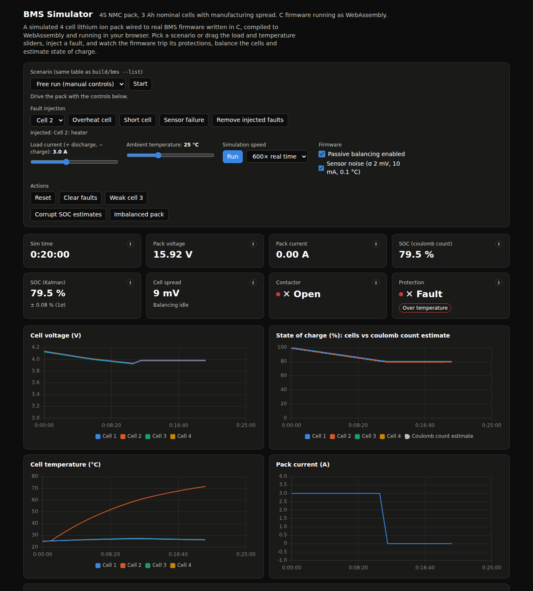
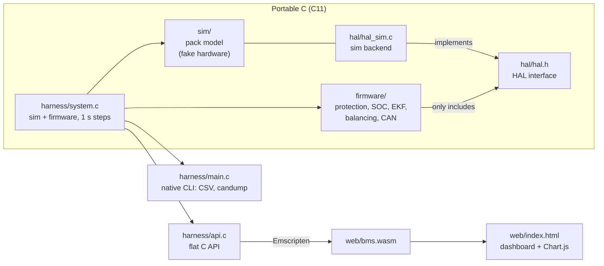

# BMS Simulator

**[Live demo: madhav140807.github.io/bms-simulator](https://madhav140807.github.io/bms-simulator/)**

[](https://github.com/Madhav140807/bms-simulator/actions/workflows/ci.yml)
[](https://github.com/Madhav140807/bms-simulator/actions/workflows/deploy.yml)
[](LICENSE)

A simulated 4 cell lithium ion battery pack plus battery management system
(BMS) firmware, written in C, compiled to WebAssembly and shown in a live
browser dashboard. The same C code runs natively for tests and CSV output, and
in the browser for the dashboard.



## Features
- **Battery pack model**: 4S NMC pack, 3 Ah cells with OCV curve, internal
  resistance, self heating and cooling, and per cell manufacturing spread.
- **Protection**: over and under voltage, over current (charge and discharge),
  over temperature and sensor plausibility, with debounce, latched faults and
  a main contactor.
- **Two SOC estimators**: coulomb counting with OCV correction at rest, and a
  per cell extended Kalman filter, shown side by side.
- **Passive balancing** with hysteresis, voltage filtering and inhibit rules.
- **CAN bus output**: five message types, a live decoded log in the dashboard
  and candump format from the command line.
- **Fault injection**: overheat a cell, add an internal short or break a
  voltage sense wire, and watch the firmware react.
- **Sensor noise** on every reading, seeded so every run is reproducible.
- **Scenarios**: nine scripted runs shared by the CLI, the tests and the
  dashboard.
- **Tests at three levels**: Unity unit tests, a WASM vs native comparison,
  and end to end browser tests in headless Chromium.

## Architecture



The firmware never sees the simulator. It only talks to `hal/hal.h`, which
uses fixed point units (mV, mA, 0.1 °C). `hal_sim.c` implements that interface
on top of the sim, so the firmware could be moved to a real board by writing a
new HAL backend. See [docs/ARCHITECTURE.md](docs/ARCHITECTURE.md) for the
design decisions.

## How it works

### Cell model
Each cell has an open circuit voltage (OCV) curve from 3.00 V at 0 % to
4.20 V at 100 %, linearly interpolated. Terminal voltage is `OCV - I * R`
(R about 20 mΩ). SOC is coulomb counted from the true current. Heat is
`I² R` plus any injected heat, against a lumped thermal mass that cools
toward ambient. Cells get a random but seeded spread in capacity (σ 1.5 %),
resistance (σ 8 %) and starting SOC. The pack puts four cells in series
behind a main contactor, with a 33 Ω bleed resistor across each cell.

### Protection state machine
Every second the firmware reads all cells and the pack current and checks:

| Fault | Trips when |
|---|---|
| Over voltage | any cell > 4250 mV |
| Under voltage | any cell < 3000 mV |
| Over current (discharge) | current > 10 A |
| Over current (charge) | charge current > 3 A |
| Over temperature | any cell > 60.0 °C |
| Sensor | cell reads outside 1000..5000 mV, or a thermistor reads below -40 °C |

A condition must hold for 3 consecutive checks before it trips. A trip
latches the fault and opens the contactor. **Clear faults** only works once
no condition is still present. An implausible reading raises a sensor fault
rather than a false over or under voltage, but a hot reading is always
treated as real.

### Coulomb counting vs Kalman filter
- **Coulomb counting** adds up current over time. It is simple and smooth,
  but any starting error stays forever. It only corrects itself after the
  pack has rested (under 50 mA) for 5 minutes, by reading SOC off the OCV
  curve.
- **The Kalman filter** runs per cell. It predicts SOC by coulomb counting,
  then compares the measured voltage with what the model expects
  (`OCV(SOC) - I * R0`) and nudges SOC by an amount weighted by its own
  uncertainty. It recovers from a wrong start under load in about 30 seconds.

Pack SOC is the lowest cell, because a series pack is empty when its weakest
cell is. Try **Corrupt SOC estimates** in the dashboard to see the difference.

### Passive balancing
Cells that sit more than 15 mV above the lowest cell are bled through their
resistor until they are within 5 mV. The firmware filters the voltages and
corrects for the small sag a bleeding cell shows, so noise does not make the
bleeders chatter. Balancing is inhibited while discharging above 500 mA, when
the lowest cell is below 3.4 V, above 50 °C, or while a fault is latched.

### CAN message map
All multi byte fields are little endian. Periodic frames are sent once per
second.

| ID | Name | Rate | Bytes |
|---|---|---|---|
| 0x080 | FAULT_EVENT | on new fault | [0] newly latched fault bits, [1] all latched bits |
| 0x100 | PACK | 1 s | [0-1] pack V (10 mV), [2-3] current (10 mA, signed, + = discharge), [4-5] Kalman SOC (0.01 %), [6] bit 0 contactor closed, [7] faults |
| 0x101 | CELL_V | 1 s | [0-7] cells 1 to 4, mV (u16 each) |
| 0x102 | CELL_T | 1 s | [0-7] cells 1 to 4, 0.1 °C (i16 each) |
| 0x103 | STATUS | 1 s | [0-1] coulomb SOC (0.01 %), [2] balance mask, [3] faults, [4] alive counter, [5-7] zero |

Fault bits: 0x01 OV, 0x02 UV, 0x04 OC discharge, 0x08 OC charge, 0x10 OT,
0x20 sensor.

## Testing

| Suite | Command | Count | What it checks |
|---|---|---|---|
| Unit | `make test` | 184 tests in 11 suites | Every module, with the Unity framework |
| WASM | `make test-wasm` | 15 tests | The WASM build gives exactly the same results and CAN frames as native for every scenario |
| Browser | `make test-browser` | 71 checks | The dashboard end to end in headless Chromium: light and dark mode, protection, balancing, scenarios, fault injection, CAN log, tooltips and narrow layouts |

CI runs all three on every push. The site only deploys after CI passes. The
browser test can also check the live site:

```sh
BMS_URL=https://madhav140807.github.io/bms-simulator/ node tests/test_browser.cjs
```

The code builds with zero warnings under gcc, clang and emcc with
`-std=c11 -Wall -Wextra -Werror`.

## Project structure

```
sim/        battery pack model: cell, pack, seeded RNG
hal/        hal.h (firmware interface) and hal_sim.c (sim backend)
firmware/   protection, soc (coulomb), ekf (Kalman), ocv, balance, can_tx
harness/    system (wiring), scenario table, CSV, CLI, flat API for WASM
tests/      Unity unit tests, WASM test, browser test (Playwright)
web/        dashboard (index.html) and the WASM build output
scripts/    screenshot generator for the README and social preview
docs/       architecture notes and images
```

## Build and run

You need gcc or clang and make. For the WASM build, Emscripten on your PATH or
in `~/emsdk`:

```sh
git clone https://github.com/emscripten-core/emsdk.git ~/emsdk
~/emsdk/emsdk install latest && ~/emsdk/emsdk activate latest
```

For the browser tests, Node and Playwright, once:
`npm install && npx playwright install chromium`.

```sh
make test                          # unit tests
make run                           # 1C discharge, CSV to stdout
make run SCENARIO=charge           # any scenario from ./build/bms --list
make scenarios                     # every scenario's CSV into build/csv/
./build/bms overcurrent --can      # CAN frames in candump log format
make serve                         # build WASM, serve the dashboard on :8000
make test-wasm                     # WASM vs native
make test-browser                  # dashboard end to end
make screenshots                   # regenerate docs/dashboard.png and web/og.png
```

## Known limitations
- The cell model is a single resistor. There is no RC pair, so it has no
  voltage relaxation after a load step and no hysteresis.
- One OCV curve for all temperatures, and resistance does not change with
  temperature or SOC.
- No aging: capacity and resistance stay the same forever.
- The firmware runs in the same process as the sim, stepped once per
  simulated second. There is no real time scheduling or interrupt timing.
- CAN frames are stored in memory. There is no bus arbitration, error frames
  or receive side.
- Four cells only; the cell count is a compile time constant.

## Future work
- Run the firmware on an emulated STM32 in **Renode**, with a HAL backend that
  talks to the sim over emulated peripherals.
- Move the firmware tasks onto **FreeRTOS** (protection, estimation,
  balancing and CAN as separate tasks).
- **Battery aging**: capacity fade and resistance growth with cycles and
  temperature, plus state of health estimation.
- A 1RC or 2RC cell model and temperature dependent parameters.

## License
[MIT](LICENSE)
